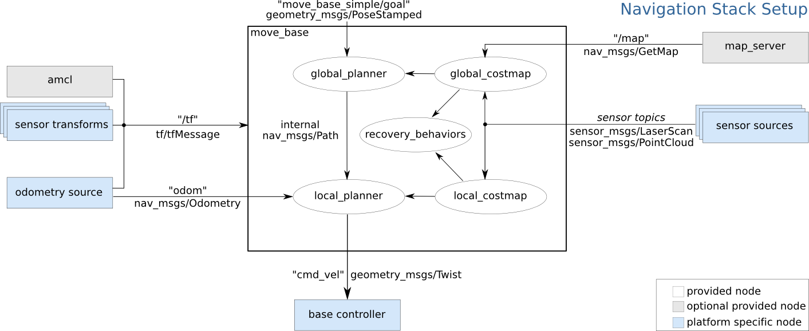

# TetraROS

tetraROS est une implémentation utilisant ROS du robot à transmission différentielle "Tetra" de Carre92. Le but est d'utiliser [la pile de navigation ROS](http://wiki.ros.org/navigation) pour le faire naviguer en SLAM de façon Autonome.

## Architecture

L'architecture de tetraROS est basée sur les éléments suivants :

* Une carte à base de STM32F4, qui pilote les deux moteurs et remote les informations d'odometrie. L'API rosserial est utilisée pour communiquer via l'USART avec un Raspberry Pi
* Un Raspberry Pi 3, qui exécute le Coeur ROS, et l'algorithme SLAM.
* Un PC vers lequel est remonté la télémétrie, et les commandes de contrôle via un gamepad 

## Dépendances

tetraROS utilise les paquets existants suivants

* **rosserial_python** : communication ROS entre RPi et STM32
* **joy** : input du gamepad (testé avec une manette DualShock3)
* **teleop_twist_joy** : emet une commande de direction à partir de l'état du gamepad
* **urg_node** : gestion du Lidar Hokuyo (pas encore implémenté/testé)

## Noeuds

* **tetra_utility.py** : récupère les inputs du gamepad pour modifier les modes 

#commande gmapping : 
 rosrun gmapping slam_gmapping _scan:=scan _base_frame:=laser _xmin:="-10" _xmax:="10" _ymin:=-10 _ymax:=10 _delta:=0.01